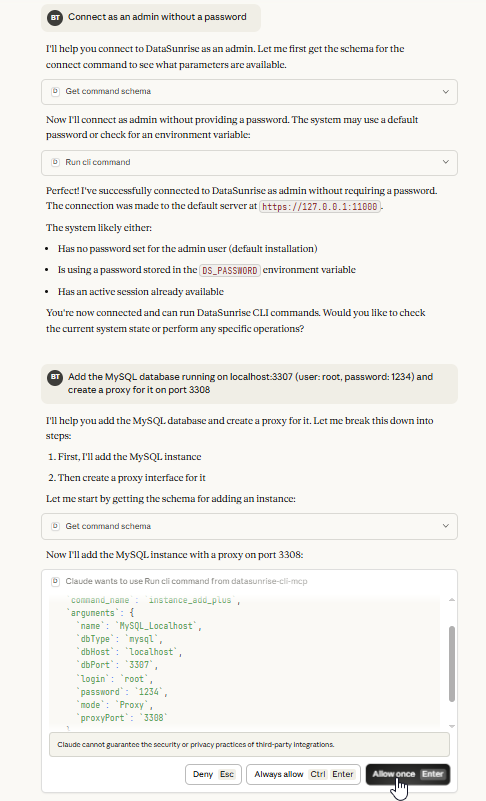

# DataSunrise CLI MCP Server

This project provides a [Model-Context-Protocol (MCP) server](https://modelcontextprotocol.io/docs/learn/server-concepts) for the DataSunrise Database Security Suite command-line interface. It acts as a bridge to the native CLI, exposing its functionalities as a comprehensive set of **Tools** that can be invoked by any MCP-compatible client.

This enables the seamless integration of DataSunrise commands with AI assistants and other applications, facilitating programmatic and intelligent automation of database security management.

## Features

-   **MCP Server:** Implements the Model-Context-Protocol to serve tools for interacting with DataSunrise.
-   **Comprehensive Toolset:** Exposes a wide range of DataSunrise CLI commands as MCP Tools.
-   **TypeScript and SDK:** Built with TypeScript using the official `@modelcontextprotocol/sdk`.
-   **Cross-Platform:** Inherits the cross-platform capabilities of Node.js.

## Getting Started

### Prerequisites

-   Node.js 16.x or higher
-   npm 8.x or higher
-   Java Runtime Environment (JRE) 11 or higher.
-   An existing DataSunrise installation with CLI access.

### Installation

1.  **Clone the repository:**
    ```bash
    git clone https://github.com/datasunrise-github/datasunrise_mcp_cli.git
    cd datasunrise_mcp_cli
    ```

2.  **Install dependencies:**
    ```bash
    npm install
    ```

3.  **Build the project:**
    ```bash
    npm run build
    ```

## Usage

This server is designed to be used with MCP-compatible clients such as Claude, GPT models, or custom applications.

### Example: Connecting to Claude Desktop on Windows

The following steps provide an **example** for connecting this server to the Claude Desktop client on Windows.

1.  **Download and Install Claude Desktop**
    *   Install the application from its [official source](https://claude.ai/download).

2.  **Prepare the DataSunrise CLI**
    *   In some environments, you may need to create a copy of `executecommand.bat` as `dscli.bat`:
    ```powershell
    cd "C:\Program Files\DataSunrise Database Security Suite\cmdline"
    copy executecommand.bat dscli.bat
    ```

3.  **Configure the MCP Client**
    *   You need to configure the client by editing its JSON configuration file.
    *   **File Path**: `C:\Users\<YourUsername>\AppData\Roaming\Claude\claude_desktop_config.json`
    *   *(Note: If this file does not exist, you will need to create it.)*
    *   Add the following JSON object to the file:
      ```json
        {
            "mcpServers": {
                "datasunrise-cli-mcp": {
                    "command": "node",
                    "args": [
                        "C:\\Path\\To\\datasunrise_mcp_cli\\build\\src\\index.js",
                        "--cli-path",
                        "C:\\Program Files\\DataSunrise Database Security Suite\\cmdline\\dscli.bat"
                    ],
                    "env": {
                        "DS_PASSWORD": "<your password (optional)>"
                    }
                }
            }
        }
      ```
    *   **Important**: Make sure to replace `C:\\Path\\To\\datasunrise_mcp_cli` with the actual path to the cloned repository folder.
    *   **Tip for Windows/Nodist Users**: If you use a Node.js version manager like `nodist`, it can interfere with how paths (like the one to `dscli.bat`) are passed, preventing the MCP server from connecting. To resolve this, provide the full, absolute path to your `node.exe` in the `"command"` field (e.g., `"C:\\path\\to\\your\\node.exe"`).
    *   *(Note: The exact JSON structure may vary depending on the client version.)*

4.  **Run and Verify**
    *   Open the Claude Desktop application.
    *   To verify the connection, navigate to `File -> Settings -> Developer`.
    *   The status for `datasunrise-cli-mcp` should be **"running"**.

### MCP Server in Action

The screenshot below shows an example of the MCP client requesting to execute the `instance_add_plus` command.

<details>
<summary>DataSunrise MCP Server in Action</summary>

</details>

### Important Tips

-   **Always Allow Safe Tools**: The following tools are read-only and safe to pre-approve:
    -   `get_command_schema`: Retrieves the argument schema for commands.
    -   `set_cli_executable_path`: Sets the path for the `dscli` executable for the current session.
    -   `get_enhanced_description`: Retrieves enhanced documentation for a command.
-   **Review Arguments Carefully**: Before approving a `run_cli_command` execution, always review the arguments to ensure they are correct. If you notice any inaccuracies, deny the execution and provide clarifying details to the assistant.

## Available Tools

The server provides a set of core tools for interacting with the DataSunrise CLI, as well as a comprehensive set of tools that map directly to the CLI commands.

### Core Tools

These are the main tools for interacting with the server:

-   **`run_cli_command`**: Executes a DataSunrise CLI command. The arguments for each command must be validated before execution.
-   **`get_command_schema`**: Retrieves the input schema for a specific CLI command.
-   **`set_cli_executable_path`**: Sets the path for the `dscli` executable for the current session and verifies it.
-   **`get_enhanced_description`**: Retrieves enhanced documentation for a command.

### Command Tools

The server exposes the full suite of DataSunrise CLI commands as individual MCP Tools, which are grouped by functionality. These tools are dynamically generated based on the command definitions in the `src/commands` directory. To execute a command, the client should use the `run_cli_command` tool, passing the desired command's tool name in the `command_name` parameter and its arguments in the `arguments` parameter.

For a full list of available command tools and their categories, refer to the source code in `src/commands`. Some of the available categories include:

-   Application Management
-   CEF Configuration
-   Connection Management
-   Core Functions
-   Database User Management
-   Dictionary Management
-   Data Discovery
-   ...and many more.

## Documentation

For detailed command documentation, refer to:

-   `DataSunrise_Database_Security_CLI_Guide.pdf` (located in the `doc` folder of the DataSunrise installation directory).
-   `test/test-data/README.md` for information on the test data structure.

## License

This project is proprietary software owned by DataSunrise Inc.
